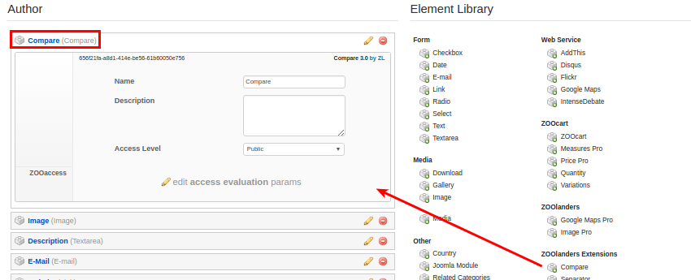
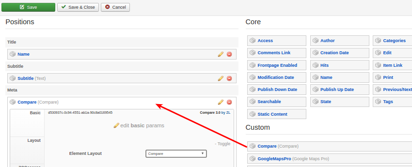
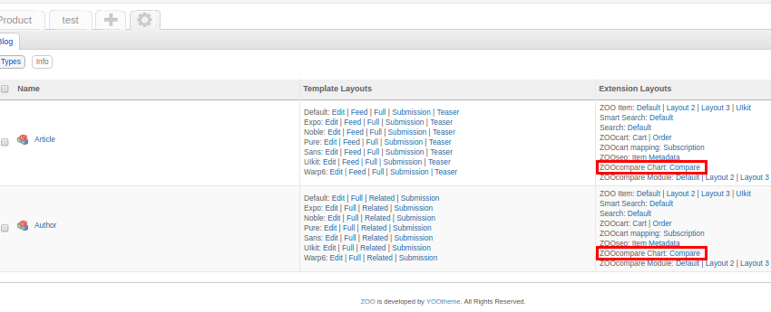
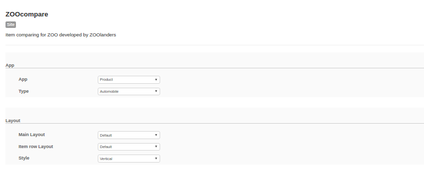
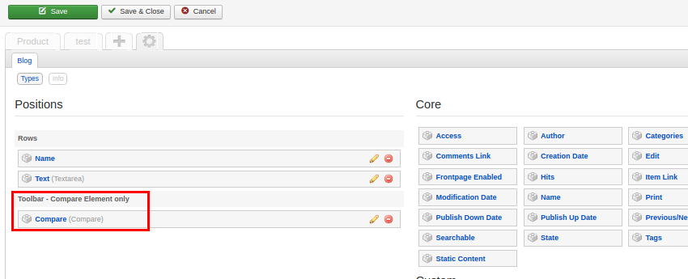
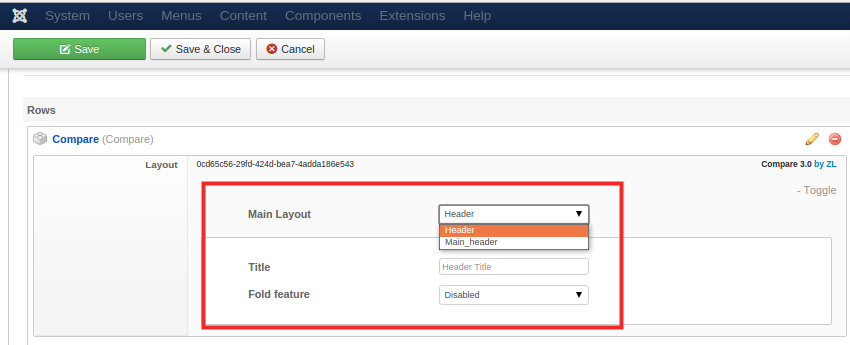
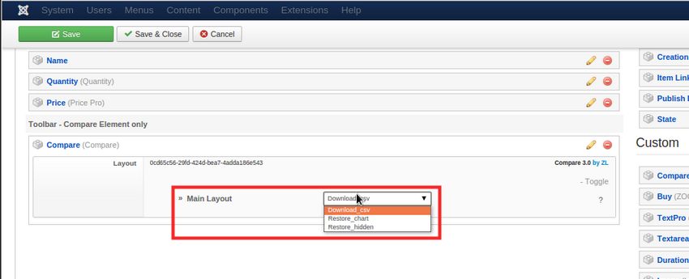

## 1. Add Compare element

The Compare element, provided with ZOOcompare, displays a button which will allow adding the Item to the comparison list. Go ahead and add the element to the Type which Items you would like to allow comparing:

If you are not familiar with the process you can review the [ZOO](http://www.yootheme.com/zoo/documentation/advanced/extend-pre-build-types) guide.

## 2. Add Compare element to render layout

Once the element is set in the Type, it must be assigned to some rendering layout, as for example the Teaser. Assign the element to the desired layout and configure as needed:

Checkout the [ZOO](http://www.yootheme.com/zoo/documentation/advanced/assign-elements-to-layout-positions) guide if you need more information about.

## 3. Comparison chart

Now that the compare button is displayed it allows adding the Items to the compare list and then access comparison chart. The Chart is very flexible and allows you to set, beside the Data to be compared, Headers, Groups, Tools and more. For setting it up open the **ZOOcompare Chart / Compare** layout assignment view for the App and Type you have set up, then Drag & Drop the elements you would like to be part of the comparison chart:

In the "Toolbar" position add the Compare element only and put the elements to compare items  in "Rows" position:
 
## 4. ZOOcompare application settings 

Finally, in the App Instance Configuration under the ZOOcompare Tab we can set the following App options:

| Field       | Description |
| :---------- | :---------- |
| **Main Layout** | The layout that will be used to display the ZOOcompare Chart. |
| **Max Items** | The maximum amount if Items that could be added for comparing at a time. |

>>> If there is no ZOOcompare section in the application settings, copy application config file `/plugins/system/zoocompare/config/application/zoocompare.xml` to your application `/config` folder 

## Module

The Module is used to display the **Items Comparison List** giving your users the ability to see what Items are going to be compare and manage it. There are several set of fields about its configuration:

>>> It is only possible to compare Items from the same App/Type at a time, however is possible displaying several Modules with different configurations on the same page.

**App**

| Field       | Description |
| :---------- | :---------- |
| **App** | The App Instance to be used within this module. |
| **Type** | The Type to be used within this module. |

**Layout**

| Field       | Description |
| :---------- | :---------- |
| **Main Layout** | The module display Layout. |
| **Item row Layout** | The **ZOOcompare Module** layout for the Item row rendering, which configuration must be set in the ZOO Type Extension layouts. |
| **Style** | The Layout style, Vertical or Horizontal. |

**General**

| Field       | Description |
| :---------- | :---------- |
| **Result Page ItemId** |  The Joomla! Menu Item to be attached to the compare link. |
| **Module Class Suffix** | The module class suffix for specific module styling. |

## Chart

The **ZOOcompare Chart** it's a responsive Bootstrap based comparison table used to display the Items selected by the User. Each column represent an Item and each row the Item element value which configuration can be set in the **Chart / Compare** layout under the ZOO Types layouts configuration view. It has two positions:

**Rows**, in this position you can place any Element which data you would like to be displayed in the Chart rows. Each Element has it's own rendering options, but the one they all share is the **If no value, render instead** field which allows setting the text to render in case the Item has not any value set for that specific element.

>>>>> You can place the **Compare** Element in this position to render special rows such as **Main Header** and **Header** or even add custom ones.

**Toolbar**, in this position you can place only the **Compare** element which will allow you choosing Toolbar buttons such as **Download CSV**, **Restore Chart** and **Restore Hidden**. Those are rendered in the Bottom of the Chart when using the Default Layout.

## Compare Element

The **Compare** element is used for several features showing different rendering layouts depending of the position and layout where it is dropped. When placed into any standard ZOO Layout position it will offer an **Add to Compare / Remove from Compare** button display, while when placed into the **Chart Compare** layout it will adapt to offer differently displays depending on the position:

When dropped in **Row** position it will offer row related displays, such as:

**Header**, will render a Header with an optional Hide/Show childs feature.

| Field       | Description |
| :---------- | :---------- |
| **Title** |  The Header title. |
| **Fold feature** | The Fold (child hiding feature) state. Allows starting with childs being hidden/unhidden or disallowing the feature completely. |

**Main Header**, will render a Header with the appropriate Item name on each column.

| Field       | Description |
| :---------- | :---------- |
| **Link to Item** | If enabled the Item Name will be linked to the Item full view. |
| **Remove button** | If enabled a button allowing to remove the Item from the Chart will be rendered. |

When dropped in **Toolbar** position will offer a Toolbar related displays, such as:

* **Download CSV**, displays a Download CSV button for the currently displayed Chart data.
* **Restore Chart**, displays a Restore button that will restore the Chart to its initial state (if some Item has been removed for example).
* **Restore Hidden**, displays a button that will restore hidden rows.

