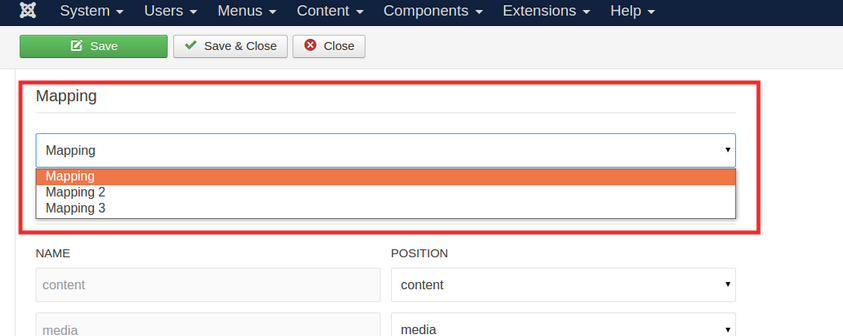

Widgetkit2 integration relies on the **Widgetkit ZOOlanders** system plugin which must be enabled before or after installing Widgetkit2 component. The plugin is distributed within ZOOlanders component but is not enabled by default. To do so locate the plugin in the **Joomla! Plugin Manager**.

Once the plugin has been enabled two integration options will become available: using the **ZOOPro Content Provider** or **Widgetkit2 Layout** available in compatible products.

## ZOOPro Content Provider

Widgetkit content provider allows setting the content in Widgetkit and use the module to output the content rendered with the selected Widget. Extending the Widgetkit2 ZOO integration, our pro version offers some extra flexibility and filter/sorting as a more advanced field mapping.

Depending on the Widget the available fields could not be enough. In such occasion you can add more using the Add Field input. For example, if your Widget has an additional `Date` field, input `date` and press the **Add** button.

Once the Fields have been defined they must be mapped to a position. This is a different concept that the one from the ZOO content provider where the mapping is done with the elements while here are the positions that are mapped. Each position has a specific role and elements can be assigned to it using the [Widgetkit Mapping Layouts](#widgetkit-mapping-layouts).

## Widgetkit Mapping Layouts

The Widgetkit Mapping layouts are used to map ZOO elements to the Widget fields, in other words, letting know the Widget what ZOO elements should be used for each of its fields. There are three inbuilt layouts which can be chosen for each integration, however it's possible creating new ones.

>>>>> The Mapping specifies the **what** but not the **how** when setting the elements, leaving the rendering up to the Widget.

As any other ZOO layout this mapping layout has several positions where the elements will be assigned. The difference relies on the rendering engine. Each position represents a Widget field to which the assigned element will be mapped. When the Widget is rendered the mapped elements will be evaluated and their content will be retrieved directly without actually rendering them. There are some exceptions, like the *content* and *custom* positions, where the elements are first rendered and the resulting content used as the field data. Those are not compatible with any field and should be used carefully.

>>>>> The Mapping layouts can be found on the ZOO App views configuration area, under the ZOO Plugins layouts.

## Widgetkit2 Layouts

**ImagePro**, **RelatedItemsPro**, **ZOOitemPro** and other products have a layout called `widgetkit2` which will render the selected Widgetkit2 Widget using the element or module content. The layout params will allow opening a Modal where the Widget and its rendering options could be set.

In case of the elements the data mapping is done programmatically on the layout it self. You can of course override or create your own layout customizing the mapping by following the [customizations guide](/extensions/zoolanders/elements/customizations).

In case of the **ZOOitemPro** module and the **RelatedItemsPro** element the mapping is done through the [Widgetkit Mapping Layouts](#widgetkit-mapping-layouts) which once set you should only choose the layout to be used.
