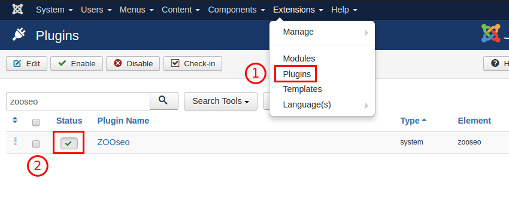
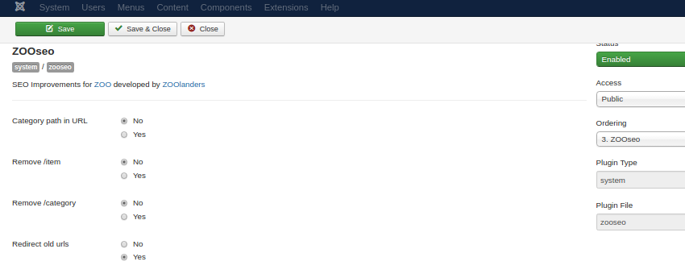
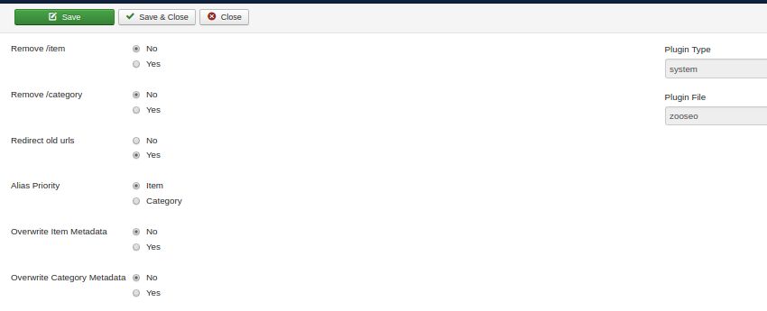
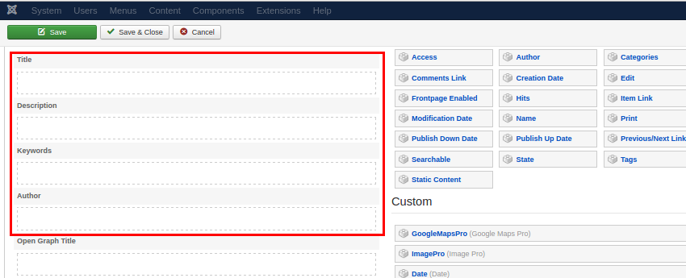
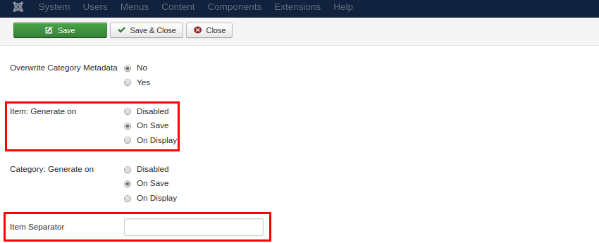
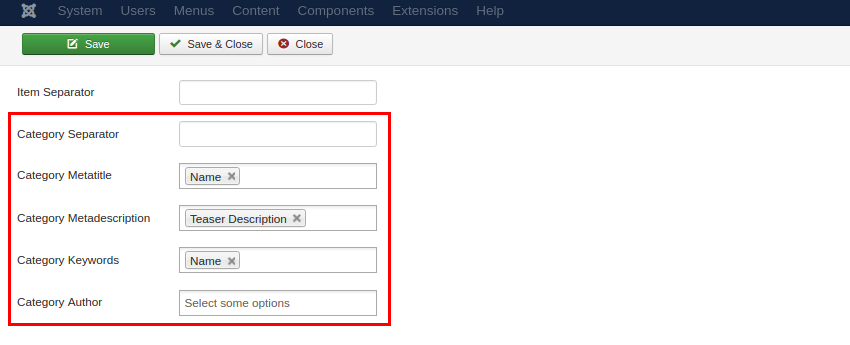
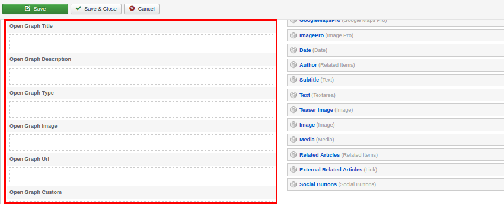

By default ZOOseo will not apply any changes to your site **SEO** leaving up to you to decide when and what best works for it. The same way **Metadata** and **Opengraph** must be carefully applied to get the most of it benefits. Let's see how is all that done.

## SEO

### 1. Enable ZOOseo plugin 

Access the ZOOseo Plugin through the **Joomla Plugin Manager** and enable it:

### 2. Settings 

Adjust or enable the following options as required:

| Field       | Description |
| :---------- | :---------- |
| **Category path in URL** | If enabled it will generate the url using the category structure, the **item**/**category** is in, removing the `/category` and `/item` and limiting the alias conflicts between category/items to the same level. The resulting URL could look like `/baseurl/category/sub-category/sub-sub-category/item-alias`. |
| **Remove /item** | If enabled the `/item` part will be removed from the generated SEF urls. |
| **Remove /category** | If enabled the `/category` part will be removed from the generated SEF urls. |
| **Redirect old urls** | If enabled it will redirect the old urls (`/item` and `/category`) to the new ones avoiding content duplication. |
| **Alias Priority** | Allows choosing which alias should take priority if a Category and an Item have the same one. |
| **Overwrite Item Metadata** | If enabled even the manually set metadata of the Item will be overwritten. Recommended only if you're fixing the site metadata, should be disabled later in order to allow custom metadata. |
| **Overwrite Category Metadata** | If enabled even the manually set metadata of the Category will be overwritten. Recommended only if you're fixing the site metadata, should be disabled later in order to allow custom metadata. |

### 3. Item Metadata

Setting the Category/Item Metadata individually is most of the times not possible nor desirable. Instead let's use the Item elements data and render it as metadata and for Categories some clever workarounds.

Locate the **ZOOseo Metadata Item** layout in your ZOO App Type configuration:

 
 Following the [elements assignment](http://yootheme.com/zoo/documentation/advanced/assign-elements-to-layout-positions) guide Drag & Drop the elements you would like to render for each one of the Metadata positions:

| Field       | Description |
| :---------- | :---------- |
| **Title** | The page title. |
| **Description** | The page description. |
| **Keywords** | A comma separate words describing the page. |
| **Author** | The page author name. |

Getting back to the ZOOseo plugin settings the following Metadata options are available:

| Field       | Description |
| :---------- | :---------- |
| **Item: Generate on** | Allows setting when the metadata should be generated, when the Item is saved or when it's displayed. **On Display** is very useful for first time metadata generation, but for its impact on the performance it's recommended leaving it to **On Save** on production. |
| **Item Separator** | The separator that will be used if there are more elements in the same position. For keywords, comma will always be used. |

### 4. Categories Metadata

The rest of the options are for the Category Metadata which as well can be automatized:

| Field       | Description |
| :---------- | :---------- |
| **Category: Generate on** | Allows setting when the metadata should be generated, when the category is saved or when it's displayed. **On Display** is very useful for first time metadata generation, but for its impact on the performance it's recommended leaving it to **On Save** on production. |
| **Category Separator** | The separator that will be used if there are more elements in the same position. For keywords, comma will always be used. |
| **Category Metatitle** | The category field value to set as the category metatitle. |
| **Category Metadescription** | The category field value to set as the category metadescription. |
| **Category Keywords** | The category field value to set as the category keywords. |
| **Category Author** | The category field value to set as the category author. |

>>>>>> Generate item/category metadata on display is great for first time generation, but has very bad performance, so it's better to leave it to "saved" for live sites.  

## Opengraph

Using the same **ZOOseo Item Metadata** layout for setting the Metadata, Drag & Drop the elements you would like to render for each one of the OpenGraph positions:

>>>>> For more information about Open Graph visit the [official page](http://ogp.me/). For testing purpose checkout [Facebook Debuger](https://www.facebook.com/login.php?next=https%3A%2F%2Fdevelopers.facebook.com%2Ftools%2Fdebug%2F).

>>>>>> You could set static information on any position using the [Static Content](/extensions/zootools/basics/static-content) element.

| Field       | Description |
| :---------- | :---------- |
| **Open Graph Title** | The title of the page. |
| **Open Graph Description** | The description of the page. |
| **Open Graph Type** | The page type, e.g. `video.movie`. |
| **Open Graph Image** | The page image URL. **Image/Pro** element value will be automatically retrieved. |
| **Open Graph Url** | The page canonical URL that will be used as its permanent ID in the graph, e.g., `http://www.imdb.com/title/tt0117500/`. |
| **Open Graph Custom** | Allows setting custom OpenGraph properties using the element **Alternative Label** field value as the property type. |

