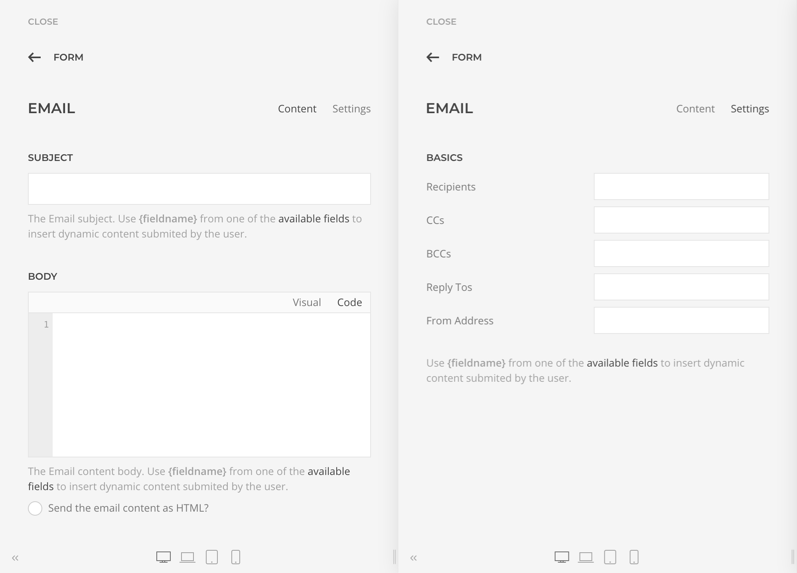
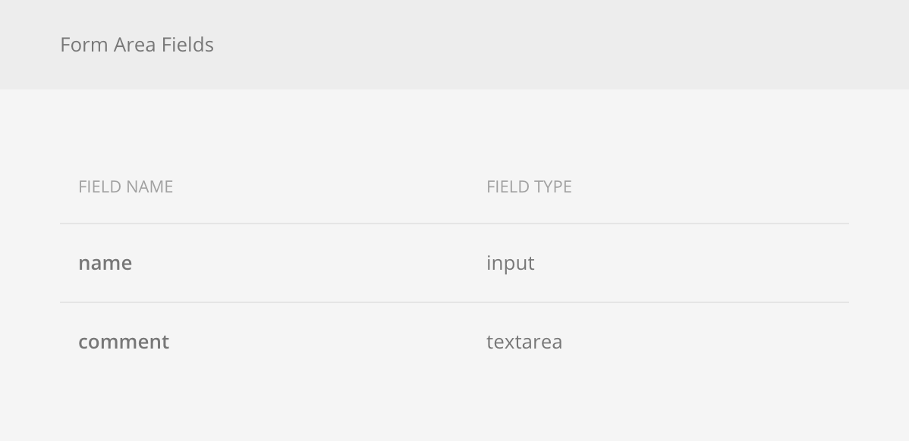
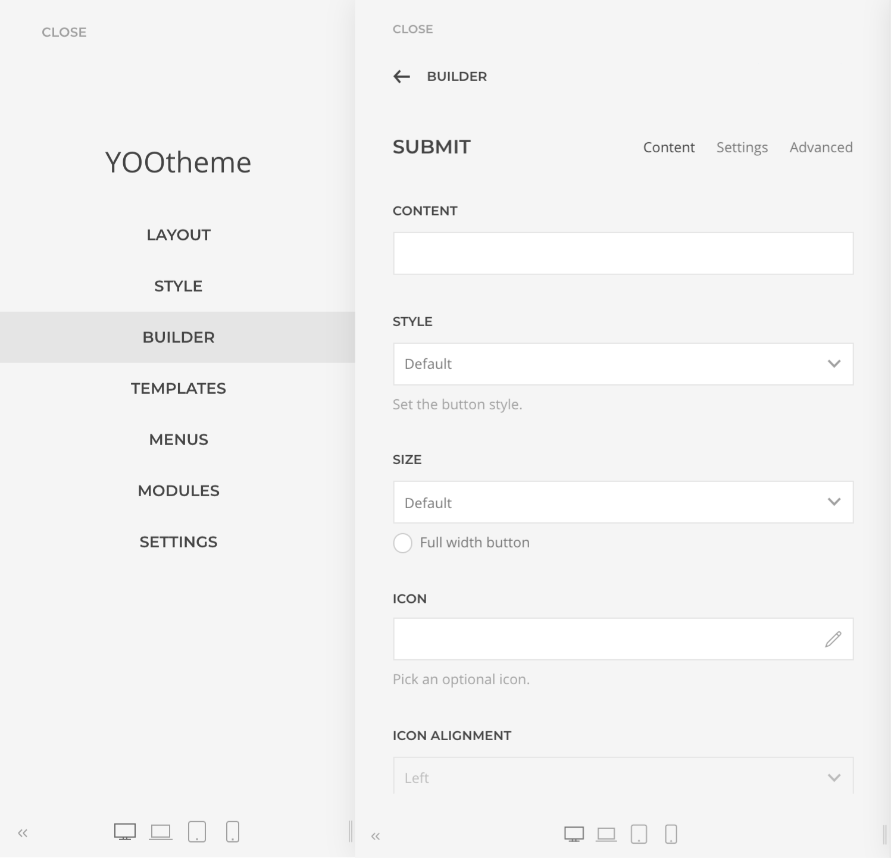
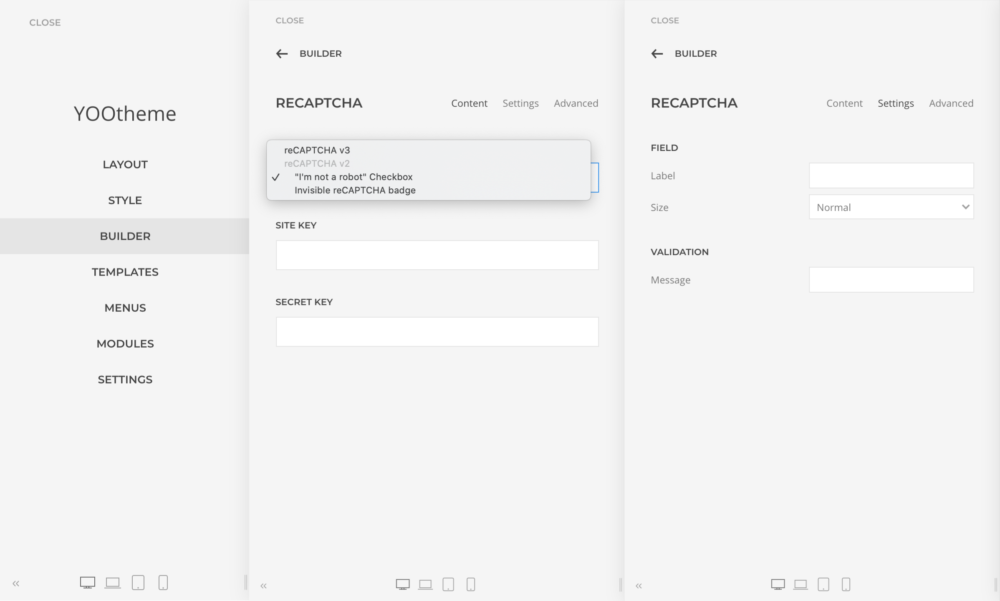

# Forms

## Actions

Form actions are an effective way to do any action after a successful submission. Those will run consequently in the order they have been set, allowing as well to run multiple actions of the same type.

### Core Actions

#### Email

This action sends a customized email with tags dynamically replaced by the submitted content. Use it to send a _Thank You_ email to the user who submitted the form, an informative email to the site administrator, etc. This action supports [Fields Tag Replacament](#fields-tag-replacement).

#### Save to CSV

This action accumulatively saves the submitted data in a CSV format to a specified file.

::: tip
To save additional data within the submission use the _Form Hidden_ element, it supports static as well as dynamic data in combination with YOOtheme Pro dynamic content.
:::

#### Redirect

This action redirects the user to a specified URL.

#### Show Message

This action displays a custom message to the user, it supports [Fields Tag Replacament](#fields-tag-replacement).

### Fields Tag Replacement

Field Tags are references to the Form Fields names as tags which would be replaced by the submitted data. For example for a Textarea field with a name _comment_, it tag equivalent `{comment}` would be dynamically replaced with the comment submitted by the user. The list of accepted field names can be reviewed on the fly by clicking on the _available fields_ link on the description of the fields supporting this feature.

## Elements

Each form element has its purpose and settings, some are meant to allow input data, others to group them as fieldsets, add a ReCaptcha verification, or submit the form among others.

### Input

Renders a standard HTML Input field with the option to choose it type. Basic validation is automatically applied depending on the chosen type, but further validation can be set.

### Textarea

Renders a standard HTML Textarea field with additional validation options.

### Select

Renders a standard HTML Select field with additional validation options.

### Checkbox

Renders a standard HTML Checkbox group of fields with additional validation options.

### Radio

Renders a standard HTML Radio group of fields with additional validation options.

### Range

Renders a standard HTML Range field with additional validation options.

### Submit

Renders a standard HTML submit button.

### Hidden

Renders a standard HTML Input hidden field. Allows submitting static or dynamically loaded data using Dynamic Content.

### Fieldset

Renders a standard HTML Fieldset field with the option to render other fields as it children, making it easier to group fields.

### Recaptcha

Renders a [Google reCAPTCHA](https://developers.google.com/recaptcha/) field, a free service that protects your site from spam and abuse. It uses advanced risk analysis techniques to tell humans and bots apart. It supports both v2 and v3, which helps you detect abusive traffic on your website without user interaction.

## Configuration Errors

In case there is something wrong with a form configuration the affected Builder Element and the form icon will turn red showing one of the following errors:

- **Not a Form Area**: it indicates that Form Fields have been dropped in an area that is not enabled as a Form Area.
- **Duplicated Form Area**: it indicates that an element that is part of a Form Area has been enabled to be a Form Area as well, eg. both a `section` and a `row` are enabled as Form Areas.
- **Missing Field Names**: it indicates that some fields of the Form Area are missing a Name.
- **Duplicated Field Names**: it indicates that some fields of the Form Area have the same Name. Field names must be unique.

