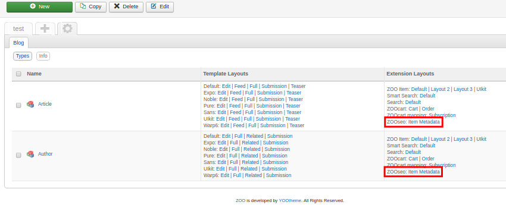

# Metadata

## Items Metadata

Setting the Category/Item Metadata individually is most of the times not possible nor desirable. Instead let's use the Item elements data and render it as metadata and for Categories some clever workarounds.

Locate the **ZOOseo Metadata Item** layout in your ZOO App Type configuration:

Drag & Drop the elements you would like to render for each one of the Metadata positions:

- `Title`: The page title.
- `Description`: The page description.
- `Keywords`: A comma separate words describing the page.
- `Author`: The page author name.

On the ZOOlanders ZOOseo Plugin settings the following Items Metadata options are available:

- `Item: Generate on`: Allows setting when the metadata should be generated.
  - `On Display`: It will generate the metadata each time an item is displayed.
  - `On Save`: It will generate the metadata only when the item is saved. This is the recommended option for production sites.
- `Item Separator`: The separator that will be used if there are more elements in the same position. For keywords, comma will always be used.

::: warning
The Generate Item metadata **On Display** can significantly affect the site performance.
:::

## Categories Metadata

On the ZOOlanders ZOOseo Plugin settings the following Category Metadata options are available:

- `Category: Generate on`: Allows setting when the metadata should be generated.
  - `On Display`: It will generate the metadata each time a category is displayed.
  - `On Save`: It will generate the metadata only when the category is saved. This is the recommended option for production sites.
- `Category Separator`: The separator that will be used if there are more elements in the same position. For keywords, comma will always be used.
- `Category Metatitle`: The category field value to set as the category metatitle.
- `Category Metadescription`: The category field value to set as the category metadescription.
- `Category Keywords`: The category field value to set as the category keywords.
- `Category Author`: The category field value to set as the category author.

::: warning
The Generate Category metadata **On Display** can significantly affect the site performance.
:::

## Open Graph

Using the ZOOseo Item Metadata layout you can Drag & Drop the elements you would like to render for each one of the OpenGraph positions:

- `Open Graph Title`: The title of the page.
- `Open Graph Description`: The description of the page.
- `Open Graph Type`: The page type, e.g. `video.movie`.
- `Open Graph Image`: The page image URL. **Image/Pro** element value will be automatically retrieved.
- `Open Graph Url`: The page canonical URL that will be used as its permanent ID in the graph, e.g., `http://www.imdb.com/title/tt0117500/`.
- `Open Graph Custom`: Allows setting custom OpenGraph properties using the element **Alternative Label** field value as the property type.

> For more information about Open Graph visit the [Open Graph official page](http://ogp.me/).

::: tip
Use the [Static Content Element](../elements/el-static-content.html) when the content is the same for each item.
:::

::: tip
For testing the results checkout [Facebook Debuger](https://www.facebook.com/login.php?next=https%3A%2F%2Fdevelopers.facebook.com%2Ftools%2Fdebug%2F).
:::

## Troubleshooting

### Category Open Graph

The Open Graph meta tags can only be applied to ZOO Item views.

### The metadata is not being displaying on the Item page

Make sure the ZOOlanders ZOOseo Plugin is enabled and that the *ZOOseo Metadata Item* layout is populated.

### The Open Graph tags are not being recognized

Some services, like Facebook, cannot scrape the website when **Joomla! GZIP** compression is enabled. As currently there is no workaround for it, the best is to keep the compression off when using Open Graph.
